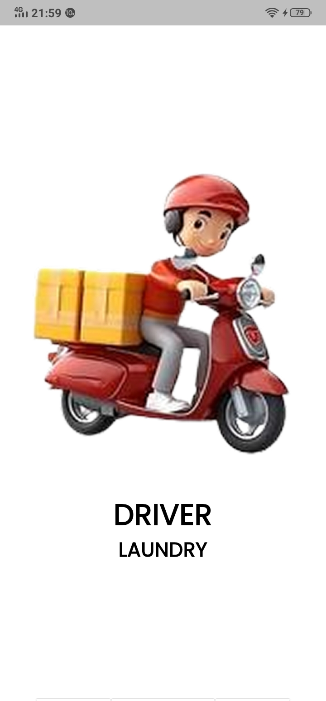
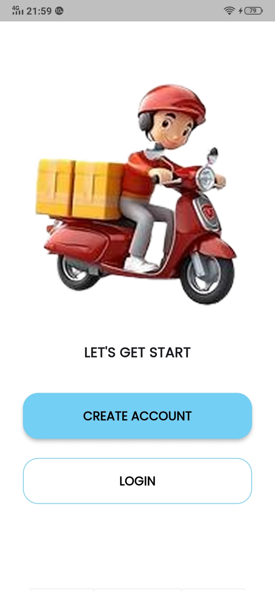
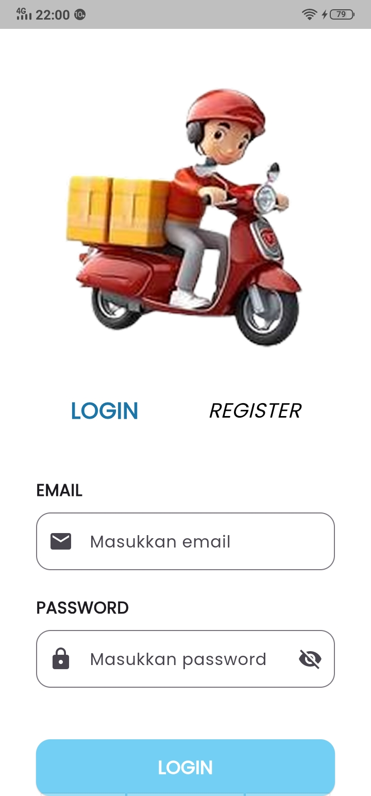
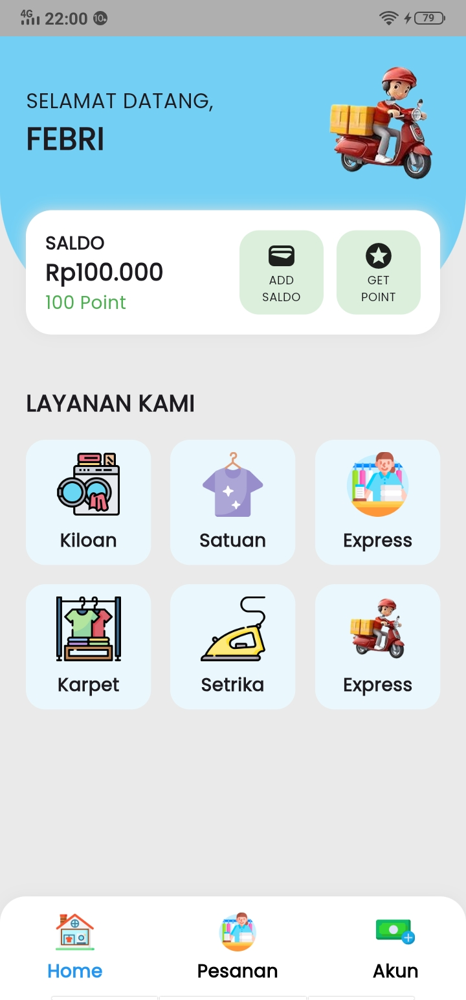
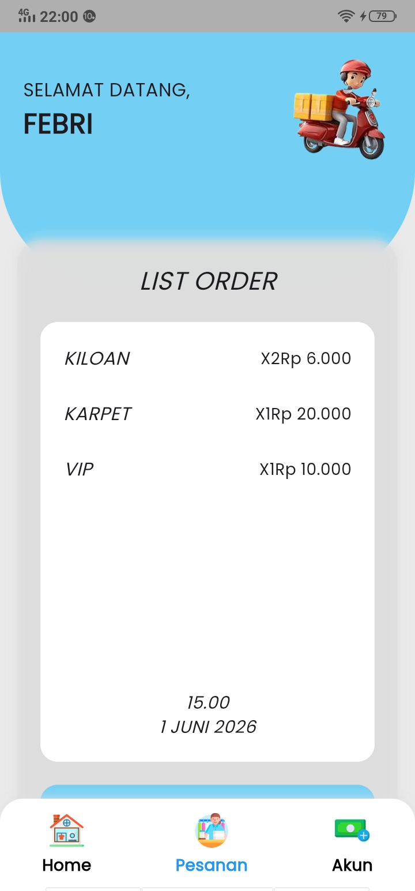
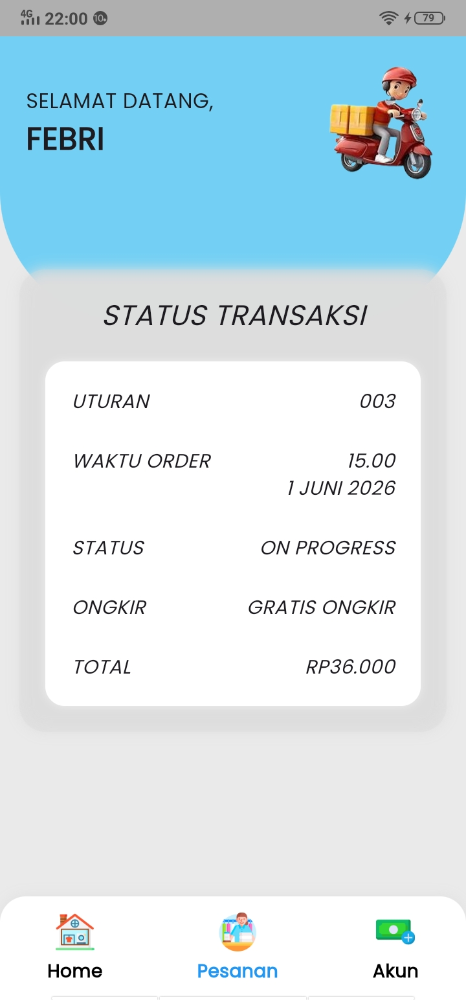
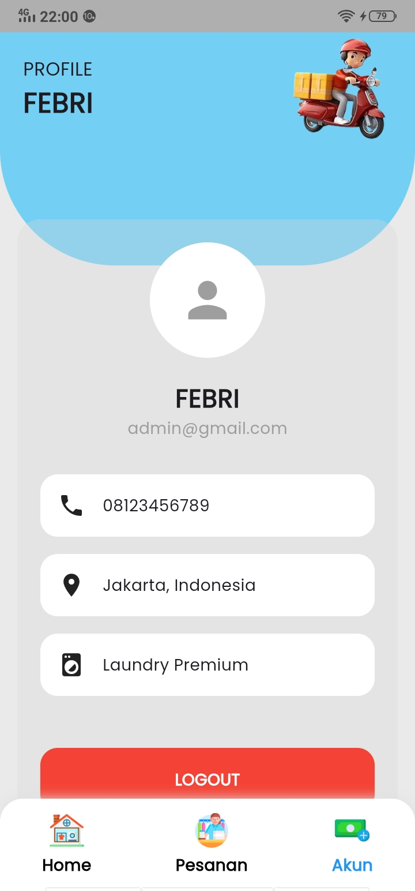

# Laundry App Flutter

Aplikasi Laundry berbasis Flutter yang dibuat berdasarkan desain UI/UX Figma untuk memenuhi tugas implementasi slicing Flutter.

## Deskripsi

Aplikasi ini merupakan implementasi desain UI/UX laundry ke dalam Flutter menggunakan dummy data tanpa backend/database. Aplikasi memiliki fitur login, halaman utama, list order, status transaksi, dan halaman akun.

## Features

* Splash Screen
* Get Started Page
* Login Page
* Home Page
* List Order
* Status Transaksi
* Account Page
* Logout Function

## UX Principles

Penerapan prinsip UI/UX pada aplikasi:

* **Consistency** → penggunaan warna, layout, dan navigasi konsisten.
* **Visibility** → informasi transaksi mudah dilihat.
* **Feedback** → validasi login dan notifikasi logout.
* **Simplicity** → navigasi sederhana dan mudah digunakan.

## Dummy Login Account

Email:

```txt
admin@gmail.com
```

Password:

```txt
123456
```

## Tech Stack

* Flutter
* Dart

## Struktur Folder

```txt
lib/
├── constants/
├── pages/
├── widgets/
├── assets/
└── main.dart
```

## Cara Menjalankan Project

1. Clone repository

```bash
git clone <repository-url>
```

2. Install dependency

```bash
flutter pub get
```

3. Jalankan aplikasi

```bash
flutter run
```

## Link Figma

https://www.figma.com/design/5XznrYfvZtZvUM6msrNG1E/LAUNDRY?node-id=0-1&p=f&t=wsTtz3Dt61FslEqP-0

##

## Screenshots

### Splash Screen


### Get Started


### Login


### Home


### List Order


### Status Transaksi


### Account

